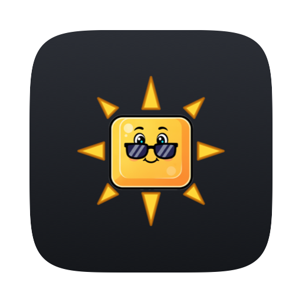
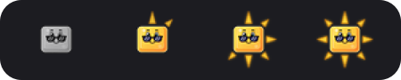

# KeyLight

<p align="center"></p>

A standalone macOS menu-bar app that remaps **Ctrl + the brightness keys** to
**keyboard-backlight** up/down, and gives **third-party keyboards** the
brightness and volume keys an Apple keyboard has on F1/F2 and F10–F12. The
menu-bar icon shows the current backlight level.

Built on [StatusItemKit](https://github.com/nicholaspsmith/StatusItemKit) (the
menu-bar shell) and [HotkeyKit](https://github.com/nicholaspsmith/HotkeyKit)
(the global key-tap engine). Part of
[Menumon](https://menumon.nicksmith.software).

**Version 1.3.0** · [Changelog](https://github.com/nicholaspsmith/keylight-menubar/releases)

## Requirements

- macOS 13+ (tested on Apple Silicon, macOS 26)
- Accessibility permission (to intercept keys)
- Sibling checkouts of `StatusItemKit` and `HotkeyKit` next to this repo (to build)

## What it does

| Trigger (default) | Action |
|-------------------|--------|
| `Ctrl + Brightness Up` | keyboard backlight up one step |
| `Ctrl + Brightness Down` | keyboard backlight down one step |
| `Ctrl + F2` / `Ctrl + F1` | the same, for keyboards whose F1/F2 are plain F-keys |

The original brightness key is swallowed, so display brightness does not
change. Rebind either backlight control in **Preferences…**.

### The menu

- **Brightness slider** — drag to set the backlight. Replaced by a disabled
  row when the backlight is unavailable or the lid is closed.
- **⚠ Grant Accessibility…** — shown only while the key tap is not trusted.
- **Preferences…** (⌘,) — rebind the two backlight controls.
- **Function Keys on Other Keyboards** — see [Third-party keyboards](#third-party-keyboards).
- **Backlight Timeout** — see [Backlight timeout](#backlight-timeout).
- **Icon** — Key (default), Gauge, Arc, Pie or Wedge; each row previews
  itself and the choice persists.
- **Start at Login**, version, **Quit KeyLight** (⌘Q).

### Dimmer than macOS allows

Above 1/16 each press is a 1/16 step. Below that the steps are 1/16, then
macOS's lowest level (1/128), then eight KeyLight levels under it, then off:

| Step | PWM duty (ticks of 960) | vs. macOS's lowest |
|------|-------------------------|--------------------|
| 1/128 (macOS floor) | 54 | 1× |
| KeyLight | 36, 24, 16, 11, 7, 4, 2 | ⅔× … 1/27× |
| KeyLight lowest | 1 | 1/54× |

macOS clamps any brightness above zero to its floor, so KeyLight holds these
levels itself. CoreBrightness fades each change through every duty on the way;
KeyLight starts slow fades toward off or toward the floor and reverses them as
the PWM register (read from the IO registry) reaches the target. Each rung
reads its target 85–98% of the time. The hardware PWM stays at 25 kHz, so
nothing flickers.

While a KeyLight level is held:

- **Backlight Timeout still works.** macOS's timeout is suspended and KeyLight
  runs it with the same setting: it fades out after that long without input
  and back in on the next.
- **Auto-brightness is paused**, and turned back on when you leave the
  KeyLight range or quit.
- **A change made elsewhere wins.** If Control Center or another app sets the
  backlight, KeyLight lets go and follows it.
- **Lid closed or asleep** pauses the hold; it resumes on wake.
- **Quitting** leaves the keys at macOS's floor with everything restored; the
  level returns at the next launch. After a crash, the next launch restores the
  timeout and auto-brightness first.

The cost is one CoreBrightness call and one flip of its
`KeyboardBacklightMuted` preference each time the fade turns, about once or
twice a second at the lowest rungs. None of this runs at macOS's own levels.
Macs whose PWM KeyLight cannot read skip the extra levels.

### Third-party keyboards

An Apple keyboard's F1/F2 and F10–F12 send brightness and volume as media
keys. A generic Bluetooth or USB board sends plain F1–F12, which macOS ignores
(or worse: F11 shows the desktop). With **Function Keys on Other Keyboards**
on (the default), KeyLight sends the media key an Apple keyboard would:

| Key on a non-Apple keyboard | Becomes |
|-----------------------------|---------|
| `F1` / `F2` | brightness down / up |
| `F10` | mute |
| `F11` / `F12` | volume down / up |

Holding a key repeats. The remap posts the same system event the Apple key
does, so macOS shows its HUD and whatever normally handles brightness keys
(the built-in display, or a DDC tool for an external monitor) handles these
too. KeyLight never talks to a display or audio device itself.

It applies only to non-Apple keyboards (identified per event from the sending
HID device), so `fn + F1` on the MacBook keyboard is still F1. Mission
Control, Spotlight and media-transport keys are not remapped.

### Backlight timeout

**Backlight Timeout** sets how long the keys stay lit with nobody typing before
macOS turns them off: 1–5 seconds, 1, 2, 5 or 10 minutes, or Never. A keypress
relights them, and so does moving KeyLight's slider or pressing its hotkeys;
the keys go dark again once the timeout passes with no input at all (external
keyboard and mouse included).

This is the same setting as System Settings ▸ Keyboard ▸ *Turn keyboard
backlight off after … of inactivity*, which only offers 5 seconds and up;
macOS accepts any delay. The checkmark shows the live value, so a change made
in System Settings shows here (a value KeyLight does not offer, like 30
seconds, checks nothing). KeyLight re-applies its choice at each launch, since
System Settings can overwrite it.

## The menu-bar icon



Lumen, a keycap in sunglasses, with eight rays that light clockwise with the
backlight (shown above at 0%, 25%, 75% and 100%). The first ray comes on at 1%,
so the icon is never dark while the backlight is on; all eight are lit at full.
Lumen is grey when the backlight is off, and also when KeyLight cannot change
it (Accessibility not granted, or the lid is closed); the menu says which.
**Icon** switches to a plain meter.

## How it works

- **HotkeyKit** owns a `CGEventTap` that intercepts the brightness media keys
  and the F-keys, matches them against the bindings, and swallows the matched
  event and its key-up. It reads the sending device from the event so F-key
  remaps can be limited to non-Apple keyboards, and treats the `fn` flag as
  implied on F-keys (macOS sets it on every F-key event from every keyboard).
- **MediaKeyPoster** posts the Apple media-key event (press + release) at the
  HID level for the F-key remaps. A posted event has no sending device, so the
  tap never mistakes its own output for a third-party keystroke.
- **CoreBrightness** (`KeyboardBrightnessClient`, private framework) reads and
  sets the built-in keyboard backlight and its inactivity timeout
  (`setIdleDimTime:forKeyboard:`, seconds, 0 = never). The keyboard id comes
  from `copyKeyboardBacklightIDs`, never hardcoded. While the backlight is
  suppressed (lid closed, or idle-dimmed) sets are no-ops, so a KeyLight
  adjustment calls `suspendIdleDimming:forKeyboard:` to relight the keys and
  resumes idle dimming after the timeout passes with no input. The suspension
  outlives the process, so a crash record lets the next launch undo it.
  Sub-floor levels use `setBrightness:fadeSpeed:commit:forKeyboard:` (the
  "speed" is the fade length in ms, at most about 32.8 s; a fade to the target
  already being faded to is ignored), `suspendIdleDimming:forKeyboard:` and
  `enableAutoBrightness:forKeyboard:`.
- **The PWM** is read from the `kbd-backlight` IO registry entry
  (`high-period`, `enabled`); its floor comes from the
  `nits-to-pwm-percentage-part2` calibration table. Design notes:
  [`docs/superpowers/specs/2026-09-25-sub-floor-backlight-design.md`](docs/superpowers/specs/2026-09-25-sub-floor-backlight-design.md).
- **KeyLightCore** holds the testable logic: the level ladder, sub-floor hold,
  bindings, timeout and icon-style models.

## Install

```sh
./install.sh
```

Builds `KeyLight.app`, symlinks it into `~/Applications`, and launches it. Grant
**Accessibility** when prompted.

### Make the Accessibility grant survive rebuilds (recommended)

An ad-hoc signed build gets a new code hash on every rebuild, and macOS drops
the Accessibility grant. Create a stable local signing identity **once**; the
build script uses it whenever it exists:

```sh
../StatusItemKit/scripts/setup-signing.sh   # one-time, idempotent
./install.sh                                # rebuild signs with it
```

Grant Accessibility once more; later rebuilds keep it.

**If the keys stop working after a rebuild**, the grant went stale: re-approve
KeyLight in System Settings ▸ Privacy & Security ▸ Accessibility. If it is
already on but inert, clear the stale entry and re-grant:

```sh
tccutil reset Accessibility com.nicholaspsmith.KeyLight
open ~/Applications/KeyLight.app
```

### Start at Login (optional)

Toggle it from the menu, or from the shell:

```sh
"$HOME/Applications/KeyLight.app/Contents/MacOS/KeyLight" --login on       # or: off, status
```

`install.sh` offers to run this when run in a terminal. Start at Login is
`SMAppService.mainApp`, which can only register the calling process's own
bundle, so the command must be the *installed* binary. A bare `--login` or
`--login status` only reports the state.

## Develop

```sh
swift build           # compile
swift test            # KeyLightCore unit tests (ladder, sub-floor hold, bindings)
swift run KeyLight    # run from the terminal (grant Accessibility to the binary)
```

## Releasing

Every push to `main` is a release. Before pushing, add a dated
`## [X.Y.Z] - YYYY-MM-DD` section to the top of [`CHANGELOG.md`](CHANGELOG.md)
(minor for features, patch for fixes; turn a waiting `## [Unreleased]` into
it). When it reaches `main`, GitHub tags `vX.Y.Z` and publishes the section as
a release titled `vX.Y.Z`. Without a new version:

- a push is refused locally by the `pre-push` hook;
- a pull request **cannot merge** — `release / check` is required on `main`;
- a push that reaches `main` anyway fails the release workflow.

The one exception is `[no release]` in the tip commit's message, for changes
nothing a user runs (setup, CI, developer docs): it passes every check with no
version bump and no tag. Never tag or create a release by hand, and never
`gh pr merge --admin` past a failing check — fix the PR. After merging,
`git pull` for the tag, rebuild (the menu's version row is stamped from it),
and update the version line at the top of this README. `install.sh` re-arms
the hook on a fresh clone. See
[StatusItemKit — Releases](https://github.com/nicholaspsmith/StatusItemKit#releases-every-push-is-one)
for the whole rule.

## Why not a SwiftBar plugin?

A standalone `.app` built on [StatusItemKit](https://github.com/nicholaspsmith/StatusItemKit) needs no SwiftBar, has a real AppKit menu instead of rendered stdout, updates on events instead of a re-run timer, and keeps its place in the bar. Intercepting the brightness keys needs a `CGEventTap`, which a plugin script cannot own at all. The full comparison is in [StatusItemKit's README](https://github.com/nicholaspsmith/StatusItemKit#why-not-swiftbar).

## The menu-bar suite

A suite of macOS menu-bar apps that share one framework, one build-and-sign
script and one installer, built to sit in the same bar: consistent menus, a
common **Icon** picker, and cooperative hiding so no icon strands another.

| App | What it does |
|---|---|
| [Claude Usage](https://github.com/nicholaspsmith/claude-usage-menubar) | Claude Code plan limits, resets, and live agent sessions |
| [Apollo Monitor](https://github.com/nicholaspsmith/apollo-monitor-menubar) | Apollo audio-interface monitor level |
| [Battery Time](https://github.com/nicholaspsmith/battery-time-menubar) | Time remaining, power mode, and 24h usage |
| [VPN & DNS](https://github.com/nicholaspsmith/vpn-dns-menubar) | An iguana for Mullvad + Tailscale state, with a DNS watcher |
| [Mac Daddy](https://github.com/nicholaspsmith/mac-daddy-menubar) | Kills media trackers, trashes stale downloads, reaps hung processes, watches the UA mixer engine, and sweats as your process count climbs |
| **KeyLight** | Ctrl+brightness keys remapped to keyboard backlight |
| [Monitor Lizard](https://github.com/nicholaspsmith/monitor-lizard-menubar) | External-monitor brightness, contrast and resolution, Night Shift, and the built-in screen from dimmer than macOS allows to XDR |
| [Homestead](https://github.com/nicholaspsmith/home-assistant-menubar) | Home Assistant dashboards and device controls in the menu |
| [SoundChain](https://github.com/nicholaspsmith/soundchain-menubar) | One chain of Audio Unit effects over all system audio |
| [Menu Crane](https://github.com/nicholaspsmith/menu-crane) | A ⌘Space launcher for apps, arithmetic, unit conversions and emoji |
| [MacRecorder](https://github.com/nicholaspsmith/MacRecorder) | Screen recording with system audio |
| [Barn](https://github.com/nicholaspsmith/menubar-barn) | macOS 26 and earlier only: hides a block of status icons by width (on macOS 27, use System Settings ▸ Menu Bar) |

| Framework | |
|---|---|
| [StatusItemKit](https://github.com/nicholaspsmith/StatusItemKit) | Status-item lifecycle, polling, menus, meter and mascot icons, the shared Icon picker |
| [HotkeyKit](https://github.com/nicholaspsmith/HotkeyKit) | CGEventTap engine for intercepting and remapping global keys |

Install the whole suite on a fresh Mac with
[macOS Dev Environment Setup](https://github.com/nicholaspsmith/MacOS-Dev-Environment-Setup):

```bash
git clone https://github.com/nicholaspsmith/MacOS-Dev-Environment-Setup.git
cd MacOS-Dev-Environment-Setup && ./bootstrap.sh --all
```

## License

Copyright (c) 2026 Nicholas Smith. Licensed under the
[Mozilla Public License 2.0](LICENSE). You may use, modify, sell and
redistribute this software, including inside proprietary products, provided
the copyright notice and license stay on these files and any modified
versions of them are made available under the same license.
